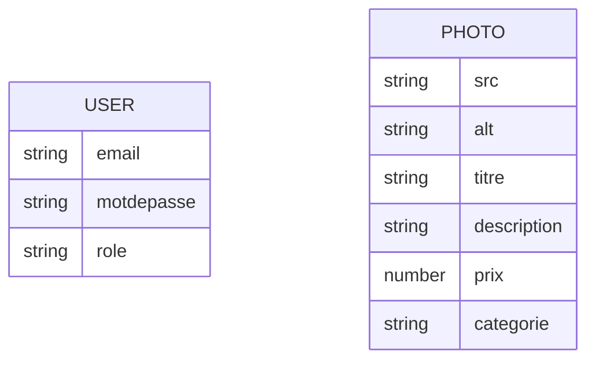

# MCD (Modèle Conceptuel de Données) – ProjetStage

## Entités principales

### 1. Utilisateur (`User`)
- **email** : chaîne, unique, obligatoire  
- **motdepasse** : chaîne, obligatoire (stocké hashé)  
- **role** : chaîne, valeurs possibles : `admin` ou `user` (défaut : `user`)

### 2. Photo (`Photo`)
- **src** : chaîne, obligatoire (chemin ou URL de l’image)
- **alt** : chaîne, obligatoire (texte alternatif)
- **titre** : chaîne, obligatoire
- **description** : chaîne, obligatoire
- **prix** : nombre, obligatoire
- **categorie** : chaîne, obligatoire

---

## Relations

- **Aucune relation directe** n’est définie dans les schémas actuels entre `User` et `Photo`.
  (Par exemple, il n’y a pas de champ `userId` dans `Photo` pour lier une photo à un utilisateur spécifique.)

---

## Représentation schématique (texte)

```
[Utilisateur]                  [Photo]
   email  <-----------------   src
   motdepasse                 alt
   role                       titre
                              description
                              prix
                              categorie
```

---

## Version visuelle du MCD

Voici une version visuelle simplifiée du MCD, sous forme de diagramme Merise (texte compatible Markdown) :



---

## Conseils et extensions possibles

- Si tu veux lier une photo à un utilisateur (ex : auteur), il faudrait ajouter un champ `userId` (ou similaire) dans le schéma `Photo` de type `ObjectId` référencé vers `User`.
- Pour une gestion de commandes, paniers, ou autres entités, il faudra compléter le MCD.

---

## Résumé
Ton MCD actuel est simple, avec deux entités indépendantes : `User` et `Photo`.  
Si tu veux un schéma graphique (diagramme), précise-le, je peux te générer une version visuelle ou te guider pour la réaliser avec un outil adapté (ex : dbdiagram.io, Lucidchart, etc.).
